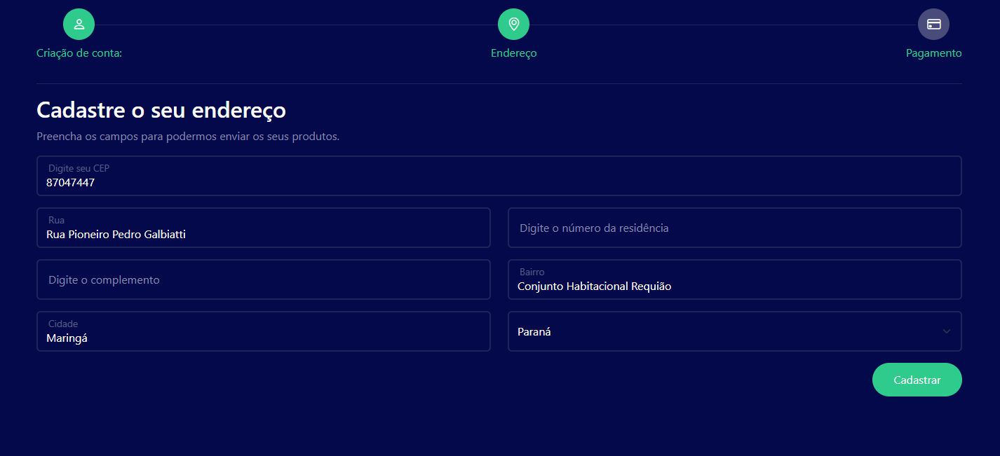

# CONSUMINDO API VIA CEP -  JAVASCRIPT - ES6

- Consumindo API via CEP, passando por conceitos JS e autocomplete.

- Projeto desenvolvido em parceria com canal Hora de Codar de Matheus Battisti (Links no final).

## Stack utilizada

**Front-end:** HTML, Javascripr e CSS.

## Screenshots

## Funcionalidades

- Simula uma compra, onde o usuário insere seu endereço com o CEP, consumindo a API e auto preencheendo apenas com o CEP informado.

## Referência

 - [Canal Hora de Codar](https://www.youtube.com/@MatheusBattisti)
 - [Playlist do canal](https://www.youtube.com/watch?v=VM4S9yffT1w&list=PLnDvRpP8BneysKU8KivhnrVaKpILD3gZ6&index=53)